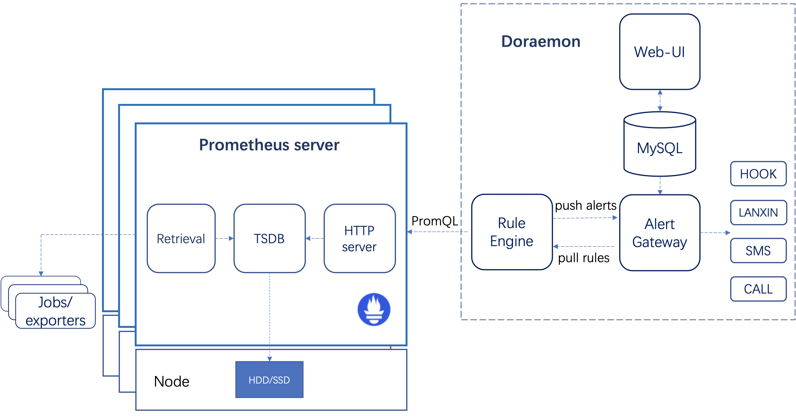

[English](README.md) | [中文](README-CN.md)

# Doraemon

[](LICENSE)

Doraemon 是一个基于 **[Prometheus](https://prometheus.io)** 的监控系统。该系统主要由三个组件组成——计算引擎（Rule Engine），报警网关（Alert Gateway）以及 Web-UI。与 Prometheus 使用静态的配置文件来配置报警规则不同，Doraemon 可以通过 Web-UI 动态的配置加载报警规则。此外，Doraemon 还集成了许多自定义的报警功能。

## 特性

- 用户可以通过 Web-UI 动态配置报警规则。
- 支持灵活的报警策略，比如报警延迟（可以实现报警升级），创建报警接收组以及值班组。用户还能通过 HOOK 的方式来发送报警，由用户自己来决定如何处理报警。
- 用户可以通过 prometheus 的标签来实现批量确认报警。
- 支持创建维护组。维护组中的机器在维护时间段内产生的报警将不会发送给用户。
- 为了减少报警发送数量，所有报警都在报警规则的维度做了报警聚合（根据该报警规则对应的报警策略每个周期聚合一次并发送）。报警恢复信息也从报警规则的维度每分钟聚合发送一次。
- 支持多种登录方式：企业版支持 LDAP/OAuth 2.0/本地登录。

## 架构

整个系统采用前后端分离的开发方案，前端使用 React 开发，后端使用 **[Beego](https://beego.me)** 框架开发，并使用 MySQL 存储数据。



## 组件

- Rule Engine: 从 Alert Gateway 动态拉取报警规则，并下发到多个 prometheus server 进行计算，与此同时接收从 prometheus server 发来的报警并转发给 Alert Gateway。
- Alert Gateway: 接收从 Rule Engine 发送的报警，并根据报警策略聚合发送报警信息。
- Web UI: 用于运维人员添加报警规则，创建报警策略、维护组，进行报警确认或者查看历史报警。

## 依赖

- Golang 1.12+ ([installation manual](https://golang.org/dl/))
- Docker 17.05+ ([installation manual](https://docs.docker.com/install))
- Bee ([installation manual](https://github.com/beego/bee))
- Node.js v10.16+ and npm 6.10+ ([installation with nvm](https://github.com/creationix/nvm#usage))
- MySQL 5.6.X (数据库最好使用该版本，否则报警时间可能显示不正常)

## 快速启动

- 克隆代码仓库

  ```bash
  $ git clone https://github.com/Qihoo360/doraemon.git
  ```

- 修改配置文件  
  1.将[deployments/docker-compose/conf/config.js](deployments/docker-compose/conf/config.js)中的"localhost"替换为本机物理网卡 ip，端口号保持不变。  
  2.修改[deployments/docker-compose/conf/app.conf](deployments/docker-compose/conf/app.conf)，将 WebUrl 中的"localhost"替换为本机物理网卡 ip，端口号保持不变。
- 启动服务  
   在 Doraemon 的根目录下，通过 docker-compose 创建服务

  ```bash
  $ cd deployments/docker-compose/
  $ docker-compose up -d
  ```

  通过上述命令，您可以从通过 http://本机ip:32000 访问 Doraemon。默认登录用户 admin，密码是 123456。

## 文档

**[Wiki](docs/readme-CN.md)**

## 贡献者

- [@BennieMeng](https://github.com/BennieMeng)
- [@JayRyu](https://github.com/jayryu)
- [@JoveYu](https://github.com/JoveYu)
- [@70data](https://github.com/70data)
