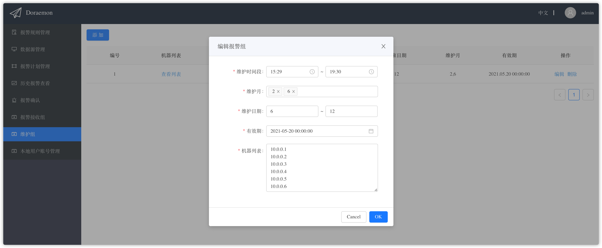

In order to create the maintain group,we must fill in the maintenance period,maintenance month,maintenance date,maintenance hosts and valid time.Before the valid time,every host's alarms in the maintain group will not be sent during the maintenance period.Note that the every host in the maintenance list is identified by the alarm's instance tag without the port after the colon.For example,if a alarm's instance tag is 10.0.0.1:9090,then in order to shield this alarm,one can add the 10.0.0.1 in the maintenance list.  
