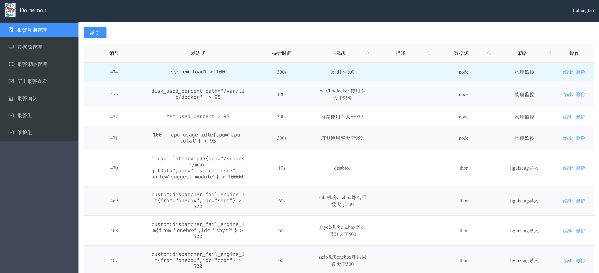

To add the rules,we must fill in the rule expression,the for clause,the summary and the description,which are all the parameters in prometheus's **[alerting rules](https://prometheus.io/prometheus/latest/configuration/alerting_rules/)**.Besides,the data source and alarm plan must be chosen.
